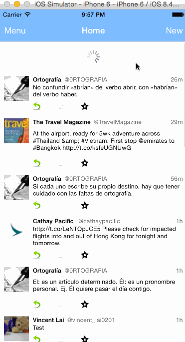

## Twitter 2

This is an enhanced version of the basic twitter app.

Time spent: `30 hours`

### Features

#### Required

- [x] Hamburger menu
   - [x] Dragging anywhere in the view should reveal the menu
   - [x] The menu should include links to your profile, the home timeline, and the mentions view.
   - [x] The menu can look similar to the LinkedIn menu below or feel free to take liberty with the UI.
- [x] Profile page
	- [x] Contains the user header view
	- [x] Contains a section with the users basic stats: # tweets, # following, # followers
- [x] Home Timeline
	- [x] Tapping on a user image should bring up that user's profile page
    
#### Optional

- [ ] Profile page
	- [ ] Implement the paging view for the user description.
	- [ ] As the paging view moves, increase the opacity of the background screen. See the actual Twitter app for this effect
	- [ ] Pulling down the profile page should blur and resize the header image.

- [ ] Account switching (basic layout)
	- [ ] Tap account to switch to
	- [ ] Include a plus button to Add an Account
	- [ ] Swipe to delete an account

### Walkthrough

